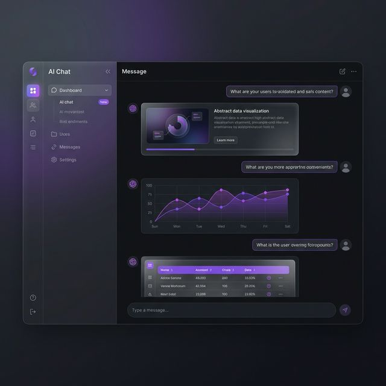

<div align="center">

# 🎨 SketchVibe

**AI Chat, Beautifully Rendered**

Transform AI conversations into stunning visual canvases with cards, charts, tables, and more.
Local-first, bring your own keys, voice-enabled.

[**🌐 Try It Live**](https://sketchvibe.app) · [**☕ Buy Me a Coffee**](https://buymeacoffee.com/soloforge) · [**🚀 Deploy with Vercel**](#deploy-your-own)



</div>

---

## ✨ Features

- **🎨 Canvas Studio** — Design custom visual themes via AI conversation. Colors, typography, layout — describe your vibe and watch it come alive.
- **📊 Visual Blocks** — AI responses render as cards, tables, charts, step flows, comparisons — not boring markdown walls.
- **🔐 100% Local-First** — All data stays in your browser. No accounts, no server storage. Export/import anytime.
- **🎙️ Voice Chat** — Speak to your AI and hear it respond. OpenAI Whisper & ElevenLabs Scribe for STT, multiple TTS voices.
- **🌐 Web Search** — Ground responses in real-time web data with Tavily. Get cited, sourced answers.
- **📎 File & Image Upload** — Attach images, code files, and documents. Multimodal support across all providers.
- **🤖 Multi-Provider** — Works with OpenAI, Anthropic, Google Gemini, and xAI Grok. Bring your own API keys.

## 🚀 Getting Started

### Use the Hosted Version

Visit **[sketchvibe.app](https://sketchvibe.app)** — no setup required.

### Run Locally

```bash
git clone https://github.com/mohdhd/sketchvibe.git
cd sketchvibe
npm install
npm run dev
```

Open [http://localhost:5173](http://localhost:5173) and add your API key in Settings.

## <a id="deploy-your-own"></a>🚀 Deploy Your Own

Deploy your own instance of SketchVibe with one click:

[](https://vercel.com/new/clone?repository-url=https%3A%2F%2Fgithub.com%2Fmohdhd%2Fsketchvibe)

> **Self-hosted mode:** Set the environment variable `VITE_SELF_HOSTED=true` to disable the tip prompt.

## 🔑 Supported Providers

| Provider | Models | API Key Prefix |
|----------|--------|----------------|
| OpenAI | GPT-5.2, GPT-5.2 Mini | `sk-` |
| Anthropic | Claude 4.6 Opus, Claude 4.5 Sonnet, Claude 4.5 Haiku | `sk-ant-` |
| Google Gemini | Gemini 3 Flash, Gemini 3 Pro | `AI...` |
| xAI Grok | Grok 4.1 Fast | `xai-` |

## 🗂️ Tech Stack

- **React** + **TypeScript** + **Vite**
- **Dexie.js** (IndexedDB) for local persistence
- **Chart.js** for rendering charts
- **KaTeX** for math/formula rendering
- **Highlight.js** for syntax highlighting

## 🤝 Contributing

Contributions are welcome! Feel free to open issues and pull requests.

1. Fork the repository
2. Create your feature branch (`git checkout -b feature/amazing-feature`)
3. Commit your changes (`git commit -m 'Add amazing feature'`)
4. Push to the branch (`git push origin feature/amazing-feature`)
5. Open a Pull Request

## ☕ Support

If you find SketchVibe useful, consider buying me a coffee!

<a href="https://buymeacoffee.com/soloforge" target="_blank"></a>

## 📄 License

MIT License — see [LICENSE](LICENSE) for details.
